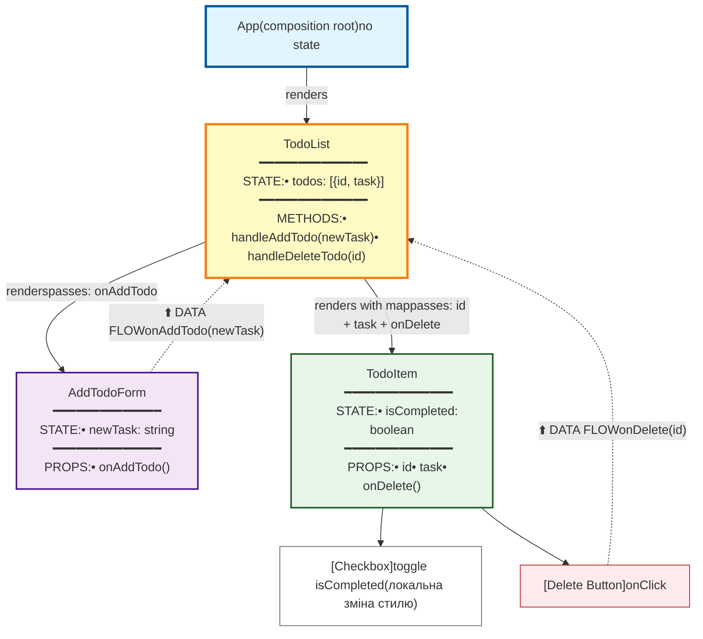

# Lab 3: Component Tree. Hooks

## Component Tree + Data Flow

### Пояснення діаграми
- **App**: Кореневий компонент, який рендерить лише `TodoList`. Не тримає стану, відповідає за композицію.
- **TodoList**:
  - **State**: `todos` — масив об’єктів `{ id, task }`, що представляє список завдань.
  - **Props**: Не отримує props.
  - **Рендерить**: `AddTodoForm` для додавання завдань і список `TodoItem` для кожного завдання.
  - **Callbacks**: Передає `onAddTodo` до `AddTodoForm` для додавання нового завдання і `onDelete` до `TodoItem` для видалення.
- **AddTodoForm**:
  - **State**: `newTask` — рядок, який зберігає текст із поля введення.
  - **Props**: Отримує `onAddTodo` (callback) для відправки нового завдання до `TodoList`.
  - **Callback**: Викликає `onAddTodo(newTask)` при submit форми, передаючи текст завдання вгору.
- **TodoItem**:
  - **State**: `isCompleted` — boolean, який визначає, чи завдання завершене (локальний стан).
  - **Props**: Отримує `id` (унікальний ідентифікатор), `task` (текст завдання), `onDelete` (callback для видалення).
  - **Callbacks**: Викликає `onDelete(id)` при натисканні кнопки "Видалити", повідомляючи `TodoList` про необхідність видалити завдання.
  - Checkbox змінює локальний стан `isCompleted`, що впливає на стиль (перекреслення).